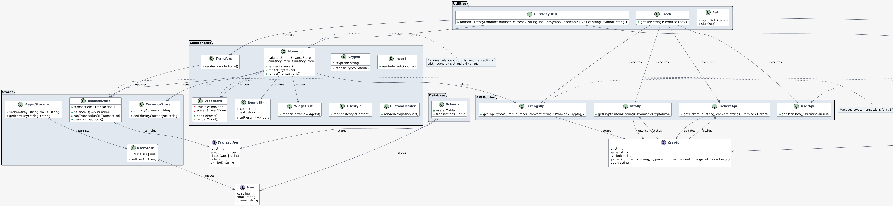

# Cointomic

**Cointomic** is a cross-platform fintech application built with React Native and **Expo 53**, designed to solve critical challenges in the cryptocurrency space. It empowers users to navigate volatile markets, manage cross-currency transactions, and securely track portfolios with real-time data (e.g., Bitcoin at ~$85,230 in July 2025). Featuring a neumorphic UI, easy EUR/NGN conversions, Clerk authentication, and Drizzle ORM, Cointomic delivers an intuitive, accessible, and reliable experience for both novice and experienced investors.

## Table of Contents
- [Problem Solved](#problem-solved)
- [Screenshots](#screenshots)
- [Architecture](#architecture)
- [Tech Stack](#tech-stack)
- [Project Structure](#project-structure)
- [Installation](#installation)
- [Running the App](#running-the-app)
- [API Integration](#api-integration)
- [Testing](#testing)
- [Contributing](#contributing)
- [License](#license)

## Problem Solved
Cointomic addresses key fintech pain points:
- **Volatile Crypto Markets**: Real-time CoinMarketCap API integration provides up-to-date prices and trends (e.g., BTC ~€78,650, ETH ~€4,162 in July 2025) for informed decision-making.
- **Cross-Currency Complexity**: Simplifies EUR/NGN conversions, making crypto accessible across markets.
- **Security and Reliability**: Clerk authentication (`@clerk/clerk-expo`) and offline support via Zustand/AsyncStorage ensure trust and uninterrupted access.
- **Inclusivity**: Comprehensive `accessibilityLabel` support enables usage by diverse audiences, including those with disabilities.
- **Portfolio Management**: Customizable widgets and transaction tracking streamline asset monitoring and financial planning.

## Screenshots
Cointomic’s intuitive UI is showcased in `doc/diagrams/` with the following screenshots:

- **Splash Page** (`app/index.tsx`):
  - Description: Welcoming launch screen introducing the Cointomic experience.
  - Screenshot:
    

- **Sign-In Screen** (`app/login.tsx`):
  - Description: Secure sign-in with Clerk authentication, supporting email/password and Google OAuth.
  - Screenshot:
    

- **Home Screen** (`app/(authenticated)/(tabs)/home.tsx`):
  - Description: Main dashboard displaying balance, top cryptocurrencies, and recent transactions.
  - Screenshots:
    <table>
      <tr>
        <td></td>
        <td></td>
      </tr>
      <tr>
        <td align="center">Home Screen</td>
        <td align="center">Home Screen Animation</td>
      </tr>
    </table>

- **Crypto Page** (`app/(authenticated)/crypto/[id].tsx`):
  - Description: Detailed view of a cryptocurrency with real-time data and trends.
  - Screenshot:
    

- **Transfers Page** (`app/(authenticated)/(tabs)/transfers.tsx`):
  - Description: Streamlined interface for sending and receiving crypto transactions.
  - Screenshot:
    

- **Invest Page** (`app/(authenticated)/(tabs)/invest.tsx`):
  - Description: Explore investment opportunities in cryptocurrencies.
  - Screenshot:
    

- **Lifestyle Page** (`app/(authenticated)/(tabs)/lifestyle.tsx`):
  - Description: Financial lifestyle features for personalized user experiences.
  - Screenshot:
    

- **Profile Page** 
  - Screenshot:
    


## Architecture
Cointomic follows a modular, user-centric architecture:
- **Navigation**: `expo-router` for file-based routing with tabs (`home`, `crypto`, `transfers`, `invest`, `lifestyle`) and modals (`account`, `lock`).
- **State Management**: Zustand for reactive stores (`BalanceStore`, `CurrencyStore`, `UserStore`).
- **Data Layer**: CoinMarketCap APIs (`info+api.ts`, `listings+api.ts`, `tickers+api.ts`) and Drizzle ORM for local SQLite storage.
- **UI**: Neumorphic design with `LinearGradient`, `BlurView`, and `react-native-reanimated` animations.
- **Utilities**: Reusable helpers for currency formatting (`currencyUtils.ts`) and API fetching (`fetch.ts`).

See the UML Diagram below for a detailed class structure.
  - Diagram:
    

## Tech Stack
- **Framework**: React Native (0.74.1), **Expo 53**
- **Language**: TypeScript
- **State Management**: Zustand (^4.5.2)
- **API Handling**: `@tanstack/react-query` (^5.50.1), Axios (^1.7.2)
- **UI Components**:
  - `expo-linear-gradient` (~13.0.2) for gradients
  - `expo-blur` (~13.0.2) for neumorphic effects
  - `react-native-reanimated` (~3.10.1) for animations
  - `@expo/vector-icons` (^14.0.0) for icons
- **Navigation**: `expo-router` (~3.5.14), `@react-navigation/native` (^6.1.17)
- **Database**: Drizzle ORM with SQLite
- **Fonts**: SpaceMono (`assets/fonts/SpaceMono-Regular.ttf`)
- **Other**: `date-fns` (^3.6.0) for date formatting, `expo-haptics` (~13.0.1) for tactile feedback

## Project Structure
```
Cointomic/
├── app/                    # Application routes and screens
│   ├── _layout.tsx         # Root navigation layout
│   ├── (authenticated)/    # Authenticated routes
│   │   ├── (tabs)/        # Tab screens (home, crypto, invest, transfers, lifestyle)
│   │   ├── (modals)/      # Modal screens (account, lock)
│   │   └── crypto/[id].tsx # Dynamic crypto details
│   ├── api/               # API routes (info, listings, tickers, user)
│   ├── db/                # Drizzle ORM schema
│   ├── login.tsx          # Sign-in screen
│   ├── signup.tsx         # Sign-up screen
│   └── verify/            # Email/phone verification
├── assets/                # Images, fonts, videos
├── components/            # Reusable UI components
│   ├── CustomHeader.tsx   # Navigation header
│   ├── Dropdown.tsx       # "More" menu
│   ├── RoundBtn.tsx       # Circular action buttons
│   └── SortableList/      # Widget list components
├── constants/             # Colors, styles, icons
├── context/               # React context (UserInactivity)
├── doc/                   # Documentation and diagrams
│   └── diagrams/          # Screenshots and UML diagrams
├── drizzle/               # Database migrations
├── store/                 # Zustand stores (balance, user, async storage)
├── utils/                 # Utilities (currency, auth, fetch)
├── android/               # Android configuration
├── ios/                   # iOS configuration
├── app.json               # Expo configuration
├── babel.config.js        # Babel configuration
├── metro.config.js        # Metro bundler configuration
├── drizzle.config.ts      # Drizzle ORM configuration
├── tsconfig.json          # TypeScript configuration
├── package.json           # Dependencies and scripts
```

## Installation
1. **Clone the Repository**:
   ```bash
   git clone https://github.com/oluwaseun-odufisan/Cointomic.git
   cd Cointomic
   ```

2. **Install Dependencies**:
   Ensure Node.js (v18 or later) and npm are installed.
   ```bash
   npm install
   ```

3. **Set Up Environment Variables**:
   Create a `.env` file in the root:
   ```env
   EXPO_PUBLIC_CLERK_PUBLISHABLE_KEY=your_clerk_key
   CRYPTO_API_KEY=your_coinmarketcap_api_key
   DATABASE_URL=sqlite://./db.sqlite
   EXPO_PUBLIC_API_URL=https://api.coinmarketcap.com
   ```

4. **Install Fonts**:
   Ensure `SpaceMono-Regular.ttf` is loaded via `expo-font`.

## Running the App
1. **Start the Development Server**:
   ```bash
   npx expo start --clear
   ```

2. **Run on iOS/Android**:
   - iOS: `npm run ios` or scan the QR code with Expo Go.
   - Android: `npm run android` or scan the QR code with Expo Go.
   - Web: `npm run web`

3. **Build for Production**:
   ```bash
   npx expo prebuild
   npx expo run:ios
   npx expo run:android
   ```

## API Integration
Cointomic leverages CoinMarketCap APIs for real-time cryptocurrency data (July 2025 prices, e.g., BTC ~$85,230). API routes are in `app/api/`:
- `info+api.ts`: Crypto metadata (logos, descriptions).
- `listings+api.ts`: Top cryptocurrencies (BTC, ETH, USDT, BNB, SOL).
- `tickers+api.ts`: Real-time price tickers.
- `user+api.ts`: User data.

**Setup**:
- Obtain a CoinMarketCap API key from [coinmarketcap.com](https://coinmarketcap.com/api/).
- Add to `.env` as `CRYPTO_API_KEY`.

**Example API Call**:
```tsx
const { data } = useQuery({
  queryKey: ['listings', primaryCurrency],
  queryFn: async () => {
    const response = await fetch(`/api/listings?limit=5&convert=${primaryCurrency}`);
    if (!response.ok) throw new Error('Failed to fetch crypto listings');
    return response.json();
  },
});
```

## Testing
1. **Run the App**:
   ```bash
   npx expo start --clear
   ```

2. **Test Key Features**:
   - **Splash Page**: Verify `splash.png` matches the launch screen.
   - **Sign-In**: Check `signin.gif` animation and Clerk authentication.
   - **Home Screen**: Confirm balance, crypto list (BTC ~€78,650), and transactions (`home.png`, `home.gif`).
   - **Crypto Page**: Test details for a crypto (e.g., BTC) in `crypto.png`.
   - **Transfers**: Ensure transaction form works (`transfers.png`).
   - **Invest/Lifestyle**: Verify layouts (`invest.png`, `lifestyle.png`).
   - **Dropdown**: Tap “More” to confirm modal styling and functionality.
   - **Accessibility**: Test with a screen reader for `accessibilityLabel`.

3. **Debugging**:
   - Log API data:
     ```tsx
     console.log('Cryptos:', cryptos);
     console.log('Store:', useBalanceStore.getState());
     ```
   - Check layout on small screens (e.g., iPhone SE).
   - Simulate API failures:
     ```tsx
     console.log('API Error:', cryptosError?.message);
     ```

4. **Unit Tests** (Planned):
   - Install Jest and React Native Testing Library:
     ```bash
     npm install --save-dev jest @testing-library/react-native
     ```
   - Example test for `Dropdown`:
     ```tsx
     import { render, fireEvent } from '@testing-library/react-native';
     import Dropdown from '@/components/Dropdown';

     test('opens modal on press', () => {
       const { getByLabelText, getByText } = render(<Dropdown />);
       fireEvent.press(getByLabelText('More options'));
       expect(getByText('View Portfolio')).toBeTruthy();
     });
     ```

## Contributing
Contributions are welcome! Follow these steps:
1. **Fork the Repository**:
   ```bash
   git fork https://github.com/oluwaseun-odufisan/Cointomic.git
   ```

2. **Create a Feature Branch**:
   ```bash
   git checkout -b feature/your-feature
   ```

3. **Commit Changes**:
   Use semantic commit messages:
   ```bash
   git commit -m "feat: add crypto chart component"
   ```

4. **Run Linters**:
   ```bash
   npm run lint
   ```

5. **Submit a Pull Request**:
   - Push: `git push origin feature/your-feature`
   - Open a PR with a detailed description.

**Guidelines**:
- Use TypeScript with strict typing.
- Follow neumorphic design (`Colors.ts`, `Styles.ts`).
- Ensure accessibility with `accessibilityLabel`.
- Add tests for new components.
- Update `doc/diagrams/cointomic_uml.puml` for architectural changes.

## License
Cointomic is licensed under the [MIT License](LICENSE).

---

**Contact**: File issues on [GitHub](https://github.com/oluwaseun-odufisan/Cointomic/issues) or email [oluwaseun.odufisan@gmail.com](mailto:oluwaseun.odufisan@gmail.com).
